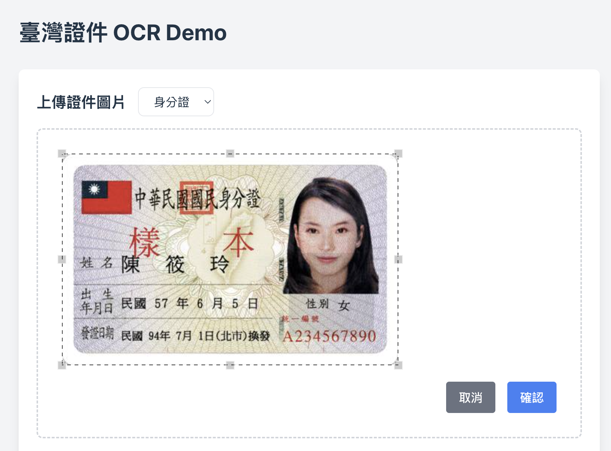
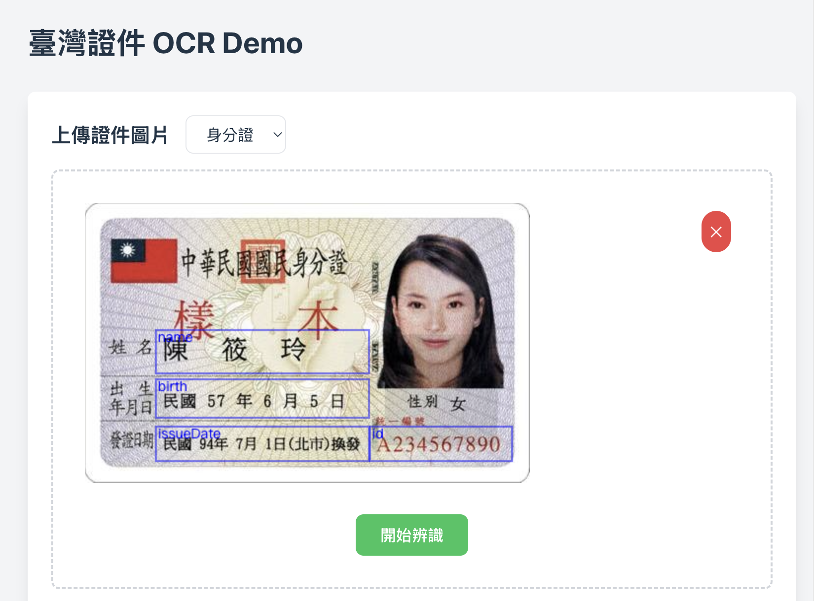
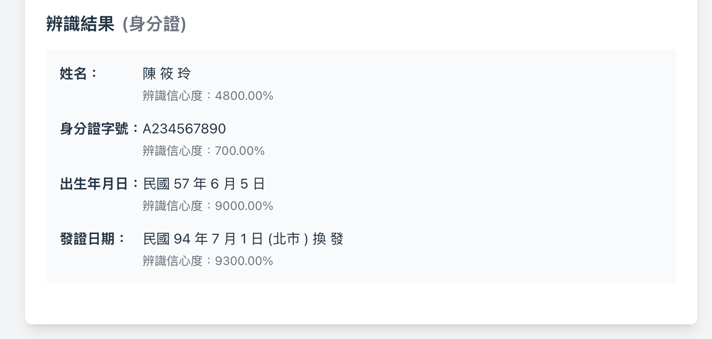

# 臺灣證件 OCR Demo (Taiwan ID Card OCR Demo)

使用 Tesseract.js, react-image-crop 實現臺灣證件文字辨識系統。
Use Tesseract.js, react-image-crop to implement the Taiwan ID OCR system.

## 功能特點 (Features)

- 支援拖放上傳圖片 (Drag and drop upload image)
- 圖片裁切功能 (Image cropping)
- 自動定位辨識區域 (Auto-locate recognition area)
- 即時顯示辨識結果和信心度 (Display recognition results and confidence scores in real-time)
- 針對不同欄位優化的辨識參數 (Optimized recognition parameters for different fields)

## 操作步驟 (Steps)

1. 從下拉選單選擇要辨識的證件類型（身分證或健保卡）

2. 將證件圖片拖放到上傳區域，或點擊選擇圖片
3. 在裁切視窗中調整圖片位置和大小

4. 確認裁切後會顯示辨識區域

5. 點擊「開始辨識」進行文字辨識
6. 查看辨識結果和信心度


## 證件圖片示意 (可儲存作為辨識範例)
- 身分證（正面）

- 健保卡（正面）


## 注意事項 (Notes)

- 請確保上傳的圖片清晰度足夠 (Ensure the uploaded image has sufficient clarity)
- 建議將證件放置在淺色背景上拍攝 (Suggest placing the ID card on a light background)
- 避免圖片中出現反光或陰影 (Avoid reflections or shadows in the image)
- 為了保護隱私，建議使用測試用的範例證件圖片 (To protect privacy, it is recommended to use the example ID card images for testing)

## 技術棧 (Tech Stack)

- React + TypeScript
- Tesseract.js
- Tailwind CSS
- React Image Crop

## 安裝與運行 (Installation and Running)

1. 安裝依賴 (Install dependencies):
```bash
npm install
```

2. 運行開發服務器 (Run the development server):
```bash
npm run dev
```

3. 訪問 http://localhost:5173 查看應用 (Visit http://localhost:5173 to view the application)