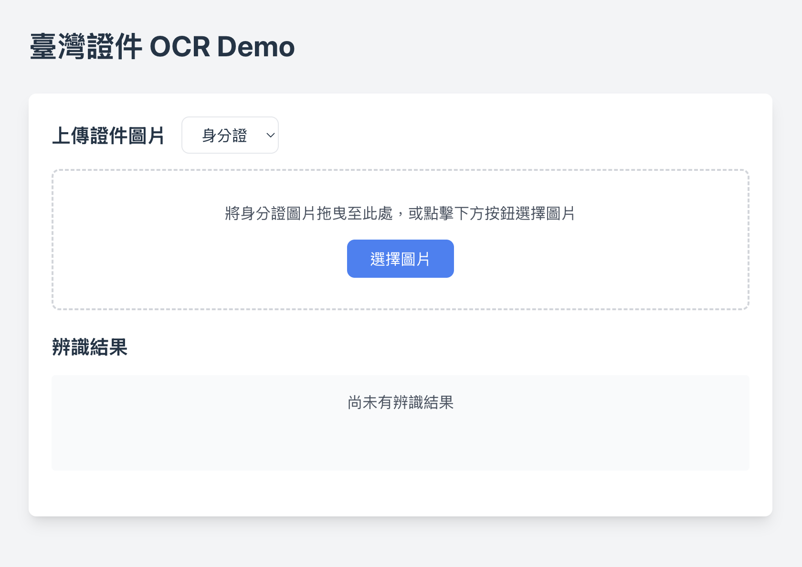

# 臺灣證件 OCR Demo

使用 Tesseract.js 實現臺灣證件文字辨識系統

## 功能特點

- 支援拖放上傳圖片
- 圖片裁切功能
- 自動定位辨識區域
- 即時顯示辨識結果和信心度
- 針對不同欄位優化的辨識參數

## 操作步驟

1. 從下拉選單選擇要辨識的證件類型（身分證或健保卡）

2. 將證件圖片拖放到上傳區域，或點擊選擇圖片
3. 在裁切視窗中調整圖片位置和大小

4. 確認裁切後會顯示辨識區域

5. 點擊「開始辨識」進行文字辨識
6. 查看辨識結果和信心度


## 證件圖片示意 (可儲存作為辨識範例)
- 身分證（正面）

- 健保卡（正面）


## 注意事項

- 請確保上傳的圖片清晰度足夠
- 建議將證件放置在淺色背景上拍攝
- 避免圖片中出現反光或陰影
- 為了保護隱私，建議使用測試用的範例證件圖片

## 技術棧

- React + TypeScript
- Tesseract.js
- Tailwind CSS
- React Image Crop

## 安裝與運行

1. 安裝依賴：
```bash
npm install
```

2. 運行開發服務器：
```bash
npm run dev
```

3. 訪問 http://localhost:5173 查看應用